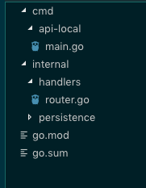

Right after starting my new position @BuzzBird I was tasked with writing a service that connects the CRM of our choice and translates it to an internal entity that we can use to identify customers.
In the process, I've learned a lot on how to write APIs in Go and this article is supposed to give you a small introduction into the topic.
There will be more articles like this in which we will continue this API so we end up with a project that you can use.

#### Disclaimer

For the sake of simplicity, I will assume that you at least have gone through the `Tour of Go` you can find [here](https://tour.golang.org/welcome/1).
It's an excellent tutorial and will give you a solid foundation to go off.<br>
As I'm pretty new to Go, I'd love to hear your feedback.
If you feel strongly about anything you see or have suggestions, please let me know, I'm always eager to learn!

#### Minimalistic Setup

As a starting point to an HTTP server, I develop a local version that I can test.
It speeds up development, makes bug hunting a lot easier and after that is running I have a natural way of building on top of it, testing new features while adding them.

#### File Structure
Since there are a lot of different opinions on this topic, you could probably write a whole blog article on this topic. What I want to give you here, is a structure you can get started with and that should work fine.<br> 
If you are interested in this topic, this is a good starting point: [Talk by Kat Zien](https://www.youtube.com/watch?v=oL6JBUk6tj0).



For the root, we should have two different sub-directories: `cmd` which will contain our main files that are used to execute our web server and `internal` which houses handlers and anything data related.<br>
If you intend on having any other Go services interact with this, a `pkg` folder, which we will use to define those types and functions of our packages that will be used by it is needed as well.

#### Setting Up The Server
After a basic set up our main.go file should look like this:
```go
package main

import (
	"net/http"

	"github.com/nandotheessen/REST-API-Example/internal/handlers"
	"github.com/sirupsen/logrus"
)

func main() {
	log := logrus.New()
	router := handlers.NewRouter(log)

	log.Println("Serving on :8080. Example here: http://localhost:8080/")
	log.Fatal(http.ListenAndServe(":8080", router), nil)
}

``` 
<br>
As you can see, all we do is initialize our router and a logger which we will use to be able to debug our application, and that will help us a lot down the line.<br>
Finally, we tell the router to accept requests on port 8080.
So far so good! Unfortunately, if we ran this now, all we get is an error.
<br>

What we haven't done yet, is to set up our router and the routes on which it will accept requests!
So let's go ahead and do just that!

```go
package handlers

import (
	"encoding/json"
	"net/http"

	"github.com/buzzbird/trading-service/pkg/api"
	"github.com/go-chi/chi"

	"github.com/sirupsen/logrus"
)

type handlerShared struct {
	log *logrus.Logger
}

func (h *handlerShared) helloWorld(w http.ResponseWriter, r *http.Request) {
	// Our logger is used to give us some confidence if the correct handlers is
	// used with our endpoint
	h.log.Log(logrus.InfoLevel, "Request received on '/'")

	// As a first step we are setting our 'Content-Type' header, since this
	// will be a REST API we won't need anything but the 'application/json' type
	w.Header().Set("Content-Type", "application/json")

	// Since JSON is not native to Go, we have to go the extra step of 'Marshalling'
	// our data - or decoding it into JSON
	// Below you can also see a simple approach to error handling, which is necessary
	// if we encounter an error, we will log this event and then exit our function
	// if this were used in an actual project, it should return a response to the user instead
	jsonData, err := json.MarshalIndent("Hello World", "", "    ")
	if err != nil {
		h.log.Log(logrus.ErrorLevel, "failed to MarshalIndent response data")
		return
	}

	// Set the HTTP status of our response
	w.WriteHeader(200)

	// And finally, send (write) the HTTP response to our user!
	_, err = w.Write(jsonData)
	if err != nil {
		h.log.Log(logrus.ErrorLevel, "failed to write response")
		return
	}

}

// NewRouter instantiates a router and adds routes and respective handlers
func NewRouter(log *logrus.Logger) *chi.Mux {
	h := &handlerShared{
		log: log,
	}

	r := chi.NewRouter()

	r.Route("/", func(r chi.Router) {
		r.Get("/", h.helloWorld)
	})

	return r
}
```

#### Structure
Since a lot is going on here, let's unpack it!<br>
After the initial import statements, we are defining the struct that will hold all our handler methods.<br>

I'm using this structure because it makes it easy to organize the methods themselves, as well as it gives me a central point to grant access to shared resources - like DB access or the logger you can see in this example!<br>
The NewRouter function uses the Chi package to create an instance of both the handerShared struct and a router.<br>
It's also responsible for adding our desired routes and combining them with their respective handlers.

#### Handlers
Compared to lagnuages like JavaScript and Python, writing even a simple response is non-trivial in Go, as it has no understanding of JSON.<br>

We'll use Marshalling to encode our data into a byte format which we can then use in our HTTP responses.<br>You can read more on the topic in this [blog article](http://localhost:8000/Writing%20REST%20APIs%20in%20Golang/).<br>

Once we venture further into this project, we'll introduce helpers that make it more convenient for us to send responses and also errors.
####What's Missing
To get to a fully functional REST API there are ways to go.
We need actual resources the user can interact with and a way for the user to interact with them!
Also, we should simplify the way we are handling HTTP requests and add a helper function for sending our responses.
All of that and more you can find in the next part of this article which I will release on 04/14, so stay tuned!