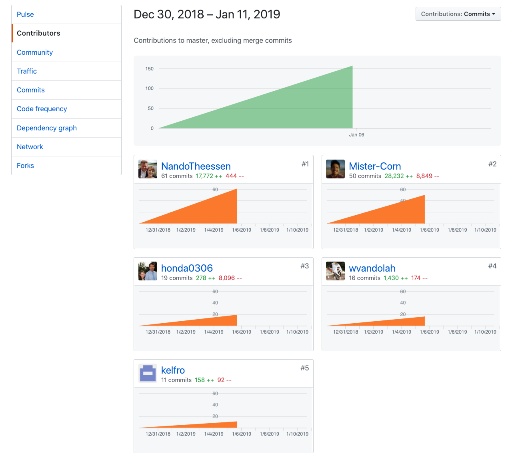

As this was our first week a lot of it was settling in. Setting up the repository,
get our tooling in order and set up all the CI / CD tools we wanted to use.

Besides the always present _troubleshooting_ the points below are were I spent most of my time.

## Time Sinks:

#### Time sink #1: OAuth via Firebase

Most of my work this week was spent on tooling and setting up the OAuth process.
I've used firebase to be able to leverage Google, Facebook, Twitter and Github for social sign ins
which is great because we can delegate the responsibility for password encryption and storage.

This was by far the most challenging point as it integrates the firebase app, and the react-firebaseui
package which I think could be improved upon (sadly they don't react to issues :( ),
but I digress.

The **hardest** part about this wasn't really the integration but the combination of _React Hooks_ and _TypeScript_
as there are quite a few gotchas. It was a great learning experience however!

#### Time sink #2: Backend setup for TypeScript using webpack

A lot of work also went into providing the setup for our backend, that uses webpack to transpile
all our typescript and still provide hot reload support which is challenging when working with
typescript as transpilation can take quite a bit of time.

#### Time sink #3: Setting up testing and writing tests

Since for us it was clear from the get-go that we'd require tests for our project to be up the "professional"
standard in labs, quite a bit of time went into setting up tests & writing them.

#### Contributions:

#### Frontend

- Ticket 1:

  - **Trello:** https://trello.com/c/OFneWZTQ
  - **GitHub:** https://github.com/Lambda-School-Labs/labs9-cleaner-pos/pull/17

- Ticket 2:

  - **Trello:** https://trello.com/c/0sI55Zzk
  - **GitHub:** https://github.com/Lambda-School-Labs/labs9-cleaner-pos/pull/23

- Ticket 3:
  - **Trello:** https://trello.com/c/bo6ZIXYF
  - **Frontend:** https://cleanerpos.netlify.com/
  - **Backend:** https://cleaner-pos.herokuapp.com/

* Ticket 4:
  - **Trello:** https://trello.com/c/76rJHmSJ
  - **GitHub :** https://github.com/Lambda-School-Labs/labs9-cleaner-pos/pull/31

#### Backend

- Ticket1:

  - **Trello:** https://trello.com/c/ubNG3hCW
  - **GitHub:** https://github.com/Lambda-School-Labs/labs9-cleaner-pos/pull/2

- Ticket2:
  - **Trello:** https://trello.com/c/76rJHmSJ
  - **GitHub:** https://github.com/Lambda-School-Labs/labs9-cleaner-pos/pull/29

#### Detailed Analysis of the Backend Setup (Ticket #1)

Most of the time of this ticket was easily spent on researching and testing the configuration for webpack.

As the use of webpack in the backend is not very popular it isn't documented very well at all which lead to a lot
of experimenting.

As we are using TypeScript on both ends of the stack, we had to come up with a solution that allows for it's use
but does not limit us in any way when developing. This is made harder as the transpilation step when using TS can
take up quite a bit of time when using either the TypeScript compiler or babel.

Everyone who's worked on the backend knows that waiting 10-20 seconds for a new run at debugging an error sums up really fast
and that it would be very annoying when working on it. This is why we decided to go for webpack.
Even though it is a lot of work to set up, it allows for hot reloading through a nifty trick.

HMR with webpack works due to webpack only transpiling the whole project _once_ and then watching for file changes compiling them on the fly.
The _"small"_ price to pay for that is to figure out how to configure it properly so it does not inhibit development in any other ways.

The easiest solution in my eyes, presents the use of two different configs for development and production.
In the development version you can make use of the `HotModuleReplacementPlugin` & `webpack/hot/poll` which will take care of the more
complex operations.
