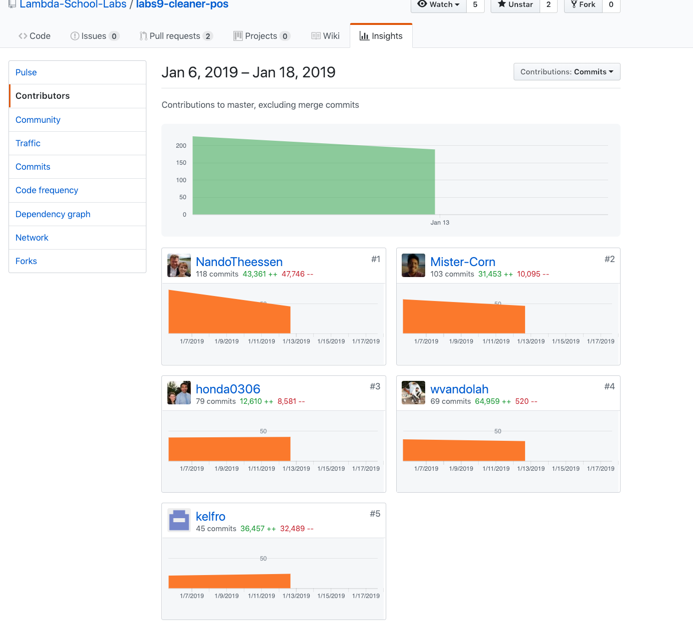

This second week felt a lot longer and harder than week 1.
Our main goal for week 2 was to implement all APIs that we decided to work with
which included big ones like stripe, stripe connect, leafletjs, AWS S3 and a few
others.
So we really did have our work cut out for ourselves.

## Time Sinks:

#### Time sink #1: stripe subscriptions for our customers

Implementing stripe for our customers took up most of my Monday and Tuesday.
In hindsight it wasn't the most difficult API to implement, but I spent quite bit of time
on figuring out what npm package to go with.
What this taught me is that I have to invest more time into researching the packages I want
to use in beforehand.
It happened twice now that I wanted more customizability out

#### Time sink #2: Backend setup for TypeScript using webpack

A lot of work also went into providing the setup for our backend, that uses webpack to transpile
all our typescript and still provide hot reload support which is challenging when working with
typescript as transpilation can take quite a bit of time.

#### Time sink #3: Setting up testing and writing tests

Since for us it was clear from the get-go that we'd require tests for our project to be up the "professional"
standard in labs, quite a bit of time went into setting up tests & writing them.

#### Contributions:

#### Frontend

- Ticket 1:

  - **Trello:** https://trello.com/c/OFneWZTQ
  - **GitHub:** https://github.com/Lambda-School-Labs/labs9-cleaner-pos/pull/17

- Ticket 2:

  - **Trello:** https://trello.com/c/0sI55Zzk
  - **GitHub:** https://github.com/Lambda-School-Labs/labs9-cleaner-pos/pull/23

- Ticket 3:
  - **Trello:** https://trello.com/c/bo6ZIXYF
  - **Frontend:** https://cleanerpos.netlify.com/
  - **Backend:** https://cleaner-pos.herokuapp.com/

* Ticket 4:
  - **Trello:** https://trello.com/c/76rJHmSJ
  - **GitHub :** https://github.com/Lambda-School-Labs/labs9-cleaner-pos/pull/31

#### Backend

- Ticket1:

  - **Trello:** https://trello.com/c/ubNG3hCW
  - **GitHub:** https://github.com/Lambda-School-Labs/labs9-cleaner-pos/pull/2

- Ticket2:
  - **Trello:** https://trello.com/c/76rJHmSJ
  - **GitHub:** https://github.com/Lambda-School-Labs/labs9-cleaner-pos/pull/29

#### Detailed Analysis of the Backend Setup (Ticket #1)

Most of the time of this ticket was easily spent on researching and testing the configuration for webpack.

As the use of webpack in the backend is not very popular it isn't documented very well at all which lead to a lot
of experimenting.

As we are using TypeScript on both ends of the stack, we had to come up with a solution that allows for it's use
but does not limit us in any way when developing. This is made harder as the transpilation step when using TS can
take up quite a bit of time when using either the TypeScript compiler or babel.

Everyone who's worked on the backend knows that waiting 10-20 seconds for a new run at debugging an error sums up really fast
and that it would be very annoying when working on it. This is why we decided to go for webpack.
Even though it is a lot of work to set up, it allows for hot reloading through a nifty trick.

HMR with webpack works due to webpack only transpiling the whole project _once_ and then watching for file changes compiling them on the fly.
The _"small"_ price to pay for that is to figure out how to configure it properly so it does not inhibit development in any other ways.

The easiest solution in my eyes, presents the use of two different configs for development and production.
In the development version you can make use of the `HotModuleReplacementPlugin` & `webpack/hot/poll` which will take care of the more
complex operations.

#### Forming our team

Our team came to be pretty naturally as the core around Ronald, William and I started in the same PM group and Kelly & Chris started with us in CS10
and also were part of our PM team when we worked with WEB 12.

Initially we were approached by a few other students to join them and we quickly arrived at the conclusion that we weren't able to work with them
because their vision of what the project should be and the tooling that would be used to make it into reality.

I think that the fact that we said no to this project was pretty disappointing for the rest of the team.

What this taught me is that while it can be unfortunate and "harsh" to decline working with someone, it is still important to not force yourself to do something
just out of the desire to not disappoint others. And that the most important thing about saying no in such a situation is, to be respectful and honest.
