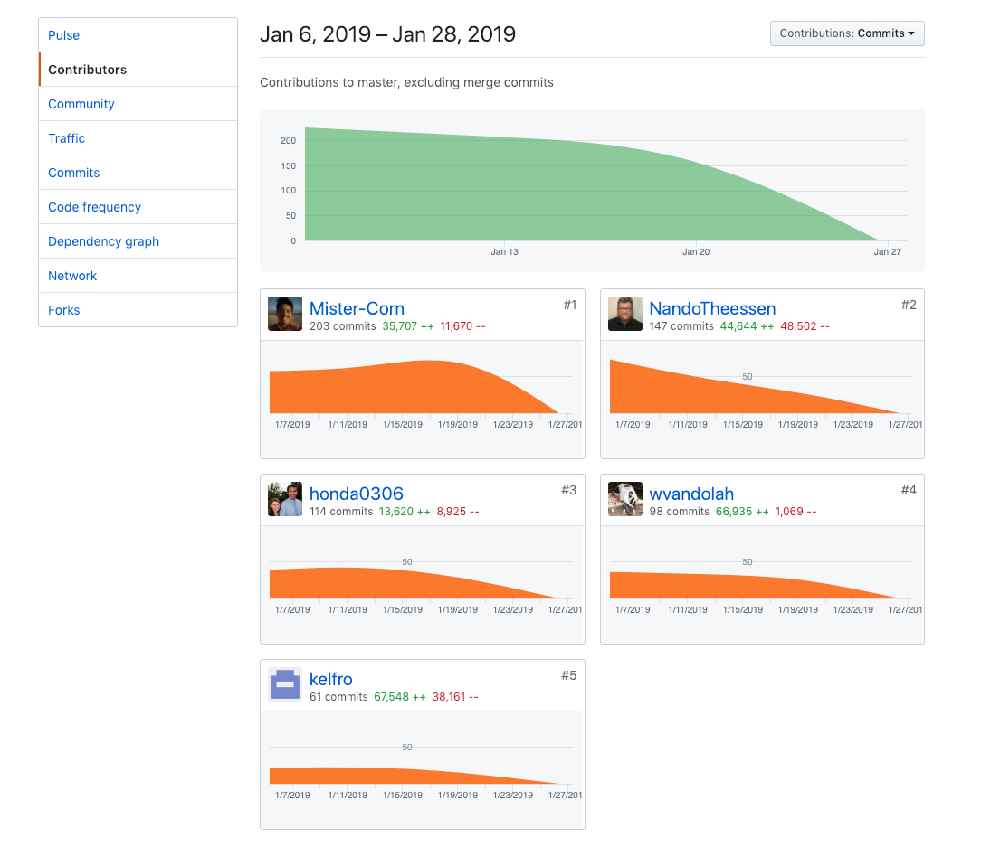

Our third week of real world production experience was a lot harder than anticipated.
I caught a cold over the weekend and in addition the scope of the week was very big.
To add insult to injury, Monday was a holiday which made the week even more challenging
than it was anyways.

Needless to say I'm more than proud that we as a team still managed to get all of our
APIs implemented in time, which took a huge effort but was successful in the end!

## Time sink #1: The Checkout Page

In the checkout page a lot of our features and APIs come together and start forming core
functionality of our app.
It displays an invoice, let's the customer use credit cards of their guests to make payments
through stripe and let's them manipulate stay data.
In order for this to work, I had to implement the core state logic of the app, add endpoints
in order to create the stripe connect charges and implement stripe OAuth for customers to connect their accounts

#### Contributions:

#### Frontend

- Ticket 1:

  - **Trello:** https://trello.com/c/RVq0jhwX
  - **GitHub:** https://github.com/Lambda-School-Labs/labs9-cleaner-pos/pull/78

- Ticket2:

  - **Trello:** https://trello.com/c/rGzIDO3e
  - **GitHub:** https://github.com/Lambda-School-Labs/labs9-cleaner-pos/pull/81

- Ticket3:
  - **Trello:** https://trello.com/c/TbmyH3TK
  - **GitHub:** https://github.com/Lambda-School-Labs/labs9-cleaner-pos/pull/91

#### Backend

- Ticket1:

  - **Trello:** https://trello.com/c/Y9m4vbdv
  - **GitHub:** https://github.com/Lambda-School-Labs/labs9-cleaner-pos/pull/88

#### Detailed Analysis of the Checkout Page

What makes this a challenging component, is the fact that it combines a lot of the state logic and APIs.
It pings multiple endpoints on the back end that had to be adjusted in order to take in the stay ID,
check if the user is already connected to stripe and gives the user the option to process a payment on the
guests behalf using their credit card.

It uses the stays endpoint to grab information for the invoice and uses the stripe connect API to create a payment
token as well as charge the payment source.
In order for this to work the stripe account of the user has to be connected first, which we solved by implementing
an OAuth component with stripe.
